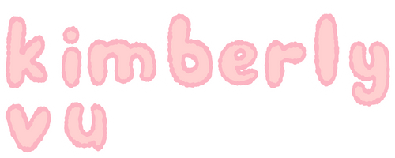

<h3 align="left">☆☆</h3>

i really like to code (ofc), participate in math competitions, and listen to music! i like to make cute websites that reflect my interests/solve my problems, and i'm currently learning how to develop video games.

<h3 align="left">currently working on:</h3>
<ul>
  <li>a personal website (who-is-kimberly)</li>
  <li>athena award from hackclub</li>
  <li>a spotify stats web app (stay tuned!!)</li>
</ul>

<!---
kimvurly/kimvurly is a ✨ special ✨ repository because its `README.md` (this file) appears on your GitHub profile.
You can click the Preview link to take a look at your changes.
--->
